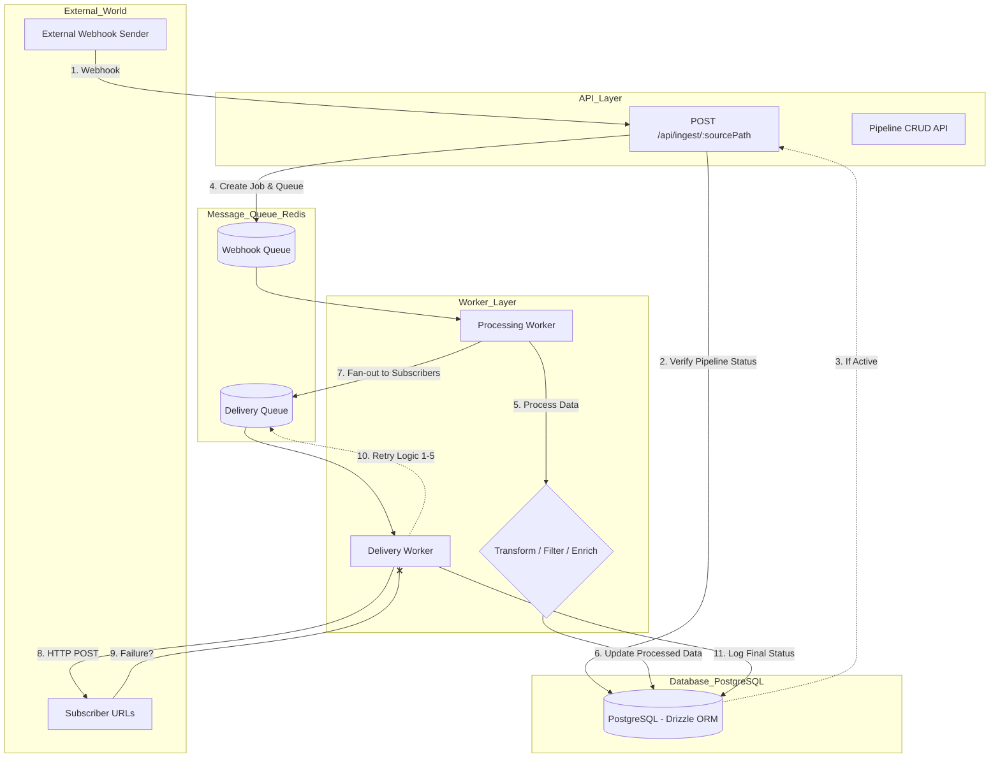

# HookPipe 🚀


HookPipe is a webhook-driven task processing pipeline designed to handle external events asynchronously.

It functions as a simplified "Zapier-like" service, where inbound events trigger processing steps before being delivered to multiple destinations with retry handling.

## 🌟 Core Features

* Full CRUD API for managing pipelines and subscribers
* Asynchronous webhook ingestion using Redis queues
* Background worker for processing and delivery
* Multiple processing actions:

  * Transform (field mapping)
  * Filter (conditional forwarding)
  * Enrich (metadata injection)
* Fan-out delivery to multiple subscribers
* Retry logic with exponential backoff
* Delivery attempt tracking
* Docker-based setup
* CI pipeline (lint, type-check, test)

## 🏗️ Architecture & Design

HookPipe follows a decoupled architecture to separate concerns and simplify system behavior:

* **API Service** — Handles ingestion and pipeline management
* **Worker Service** — Processes jobs and handles delivery
* **Redis (BullMQ)** — Manages job queues
* **PostgreSQL (Drizzle ORM)** — Stores pipelines, jobs, and delivery attempts

## 👩🏻‍💻 Design Decisions

### 1. Queue-based Processing

Webhook handling is decoupled using a queue system (BullMQ + Redis).

**Why?**

* Prevents blocking API requests
* Improves scalability under load
* Enables retry and failure handling

### 2. Fan-out Architecture

Each processed webhook is delivered independently to multiple subscribers.

**Why?**

* Supports multiple integrations per pipeline
* Isolates failures (one subscriber failing doesn’t affect others)
* Matches real-world webhook systems

### 3. Strategy Pattern for Actions

Processing logic is implemented using the Strategy Pattern.

Each action (Transform, Filter, Enrich) is a separate strategy with a shared interface.

**Why?**

* Easy to extend (add new actions without modifying existing code)
* Improves testability
* Keeps logic modular and clean

### 4. Separation of Processing and Delivery

Processing the webhook and delivering results are handled as separate steps.

**Why?**

* Clearer responsibility boundaries
* Better failure handling
* Easier debugging and monitoring

## 🔄 System Flow



## Processing Flow

1. Webhook is received at `/api/ingest/:sourcePath`
2. Pipeline is resolved and validated
3. Job is added to the queue
4. Worker processes the job:

   * Executes action (transform / filter / enrich)
   * Skips if filtered out
5. Result is delivered to subscribers (fan-out)
6. Failed deliveries are retried automatically
7. All attempts are stored in the database

## 🛡️ Reliability

* Jobs are processed asynchronously
* Failed deliveries are retried using exponential backoff
* Delivery attempts are stored for tracking and debugging

Retry configuration:

* Attempts: 5
* Backoff: Exponential
* Initial delay: 1000ms

## 📡 API Endpoints

### Pipelines

* `POST /api/pipelines`
* `GET /api/pipelines`
* `GET /api/pipelines/:id`
* `PATCH /api/pipelines/:id`
* `DELETE /api/pipelines/:id`

### Webhook Ingestion

* `POST /api/ingest/:sourcePath`

### Jobs

* `GET /api/jobs/:id`
* `GET /api/jobs/:id/attempts`

## 📂 Project Structure

```
src/
├── api/        # Controllers, routes, validation
├── db/         # Database schema and queries
├── worker/     # Background processing and strategies
└── shared/     # Queue setup and shared utilities
```


## 🚀 Getting Started

### 1. Setup environment

```bash
cp .env.example .env
```

### 2. Run the project

```bash
docker compose up --build
```

API will be available at:

```
http://localhost:3000
```

## 🛠️ Tech Stack

* Node.js + TypeScript
* Express
* PostgreSQL
* Redis + BullMQ
* Drizzle ORM
* Zod
* Vitest
* GitHub Actions

## 🔮 Future Improvements

* Idempotency handling to prevent duplicate processing
* Dead Letter Queue (DLQ) for failed jobs
* Webhook signature verification
* Authentication and authorization
* Rate limiting
* Structured logging and monitoring


## 🎯 Project Goal

This project demonstrates how to build a simplified event-driven system that:

* Receives events
* Processes them asynchronously
* Delivers results reliably

With a focus on clean architecture and extensibility.
