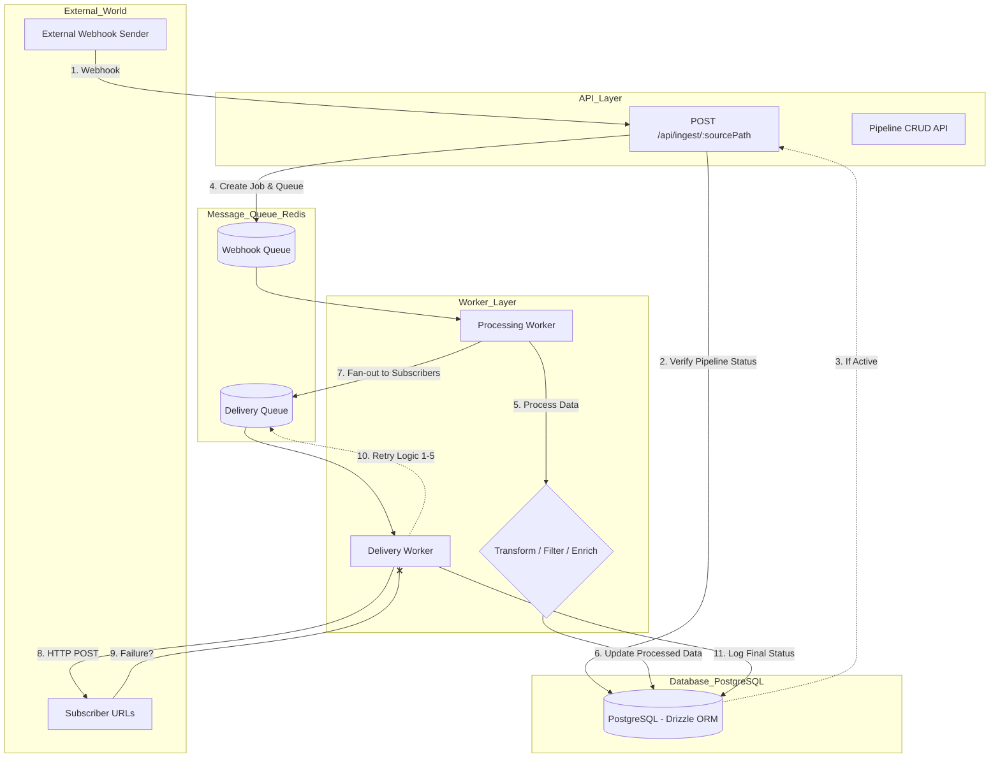

# HookPipe 🚀


**HookPipe** is a high-performance, scalable webhook-driven task processing pipeline designed to handle external events asynchronously. It functions as a simplified "Zapier-like" service, where inbound events trigger a series of processing steps before being delivered to multiple destinations with guaranteed reliability.

## 🏗️ Architecture & Design Decisions

The system is built on a **Decoupled Service Architecture** to ensure a clean separation of concerns and system stability:

*   **API Service:** Handles high-speed webhook ingestion and pipeline management (CRUD).
*   **Worker Service:** An isolated background consumer that executes processing logic and handles delivery.
*   **Message Broker (Redis/BullMQ):** Orchestrates communication between services using a **Fan-out pattern**.
*   **Persistence (PostgreSQL/Drizzle):** Stores configurations, job states, and a detailed history of delivery attempts.

### 📊 System Flow Diagram (Mermaid)




## 🛡️ Reliability & Fault Tolerance

One of the project's pillars is **Reliability**. We handle failures through:
*   **Exponential Backoff:** Retries failed deliveries up to 5 times with increasing delays (`1s`, `2s`, `4s`, etc.) to avoid overloading targets.
*   **Atomic Updates:** Using SQL increments for retry counts to prevent race conditions.
*   **Delivery Tracking:** Every HTTP attempt is logged with status codes and durations for full transparency.

---

## ⚙️ Processing Actions

HookPipe supports three distinct action types that modify or filter the payload before delivery :
1.  **Transform:** Re-maps input fields to match destination requirements (e.g., renaming fields).
2.  **Filter:** Conditional logic (equals, contains, etc.) that decides if the payload should proceed.
3.  **Enrich:** Appends additional metadata (Job ID, timestamps) to the payload for better traceability.

---

## 🔌 API Documentation (OpenAPI Specs)

### 1. Webhook Ingestion
-   `POST /api/ingest/:sourcePath`: Receives JSON data and returns `202 Accepted`.

### 2. Pipeline Management
-   `POST /api/pipelines`: Create a pipeline with actions and subscribers.
-   `GET /api/pipelines`: List all active pipelines.
-   `PATCH /api/pipelines/:id`: Smart-sync subscribers and update configurations.

### 3. Monitoring (Observability)
-   `GET /api/jobs/:id`: Query real-time status and processed results.
-   `GET /api/jobs/:id/attempts`: Access the full retry history and delivery logs.

---

## 📂 Project Structure

```text
src/
├── api/             # Controllers, Routes, and Zod Validations
├── db/              # Drizzle Schemas and Data Access Objects (Queries)
├── worker/          # Background Processors (Transform/Filter/Enrich)
└── shared/          # Redis connection and Shared BullMQ Queues
```

---

## 🚀 Getting Started

The entire stack runs via **Docker Compose** for a "works on first try" experience.

### 1. Environment Configuration
```bash
cp .env.example .env
```

### 2. Running the Service
```bash
docker compose up --build
```
*API is available at `http://localhost:3000`.*

### 3. Database Studio
To monitor jobs and delivery attempts in real-time:
```bash
npx drizzle-kit studio
```

---

## 🛠️ Tech Stack
-   **Runtime:** Node.js (v22) & TypeScript.
-   **Database:** PostgreSQL with Drizzle ORM.
-   **Queue:** Redis & BullMQ.
-   **CI/CD:** GitHub Actions (Lint, Type Check, Build).

