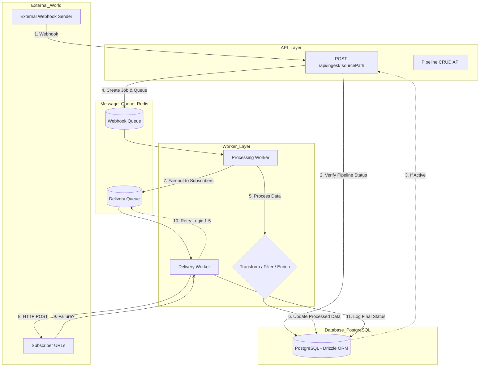

# HookPipe 🚀


**HookPipe** is a high-performance, scalable webhook-driven task processing pipeline designed to handle external events asynchronously. It functions as a simplified "Zapier-like" service, where inbound events trigger a series of processing steps before being delivered to multiple destinations with guaranteed reliability.


## 🌟 Core Features

* **Full CRUD API:** Comprehensive management of pipelines and subscribers via a strictly typed REST interface.
* **High-Performance Ingestion:** Unique source URLs (secured via **12-character NanoIDs**) accept JSON payloads and immediately queue them in **Redis**, providing low-latency responses while offloading heavy lifting to background workers.
* **Worker-Based Processing:** Extensible background execution handling **Transform** (key re-mapping), **Filter** (conditional drops), and **Enrich** (metadata injection) actions.
* **Reliable Fan-out Delivery:** Processed events are distributed to multiple subscribers. The system utilizes a **fan-out pattern** where a single processed event generates independent job entries for every destination, ensuring a failure at one endpoint does not impact others.


## 🏗️ Architecture & Design Decisions

The system is built on a **Decoupled Service Architecture** to ensure a clean separation of concerns and system stability:

* **API Service:** An Express-based application focused on pipeline management (CRUD) and ingestion. It validates incoming data using **Zod** and persists configurations to PostgreSQL.
* **Worker Service:** An isolated background consumer that executes processing logic and handles delivery.
* **Fan-out Architecture:** HookPipe manages the event lifecycle through a two-stage queuing process:
    * **Action Processing:** A job is added to the `webhook-queue`. The worker executes the pipeline's logic.
    * **Job Fan-out:** Upon successful processing, the system "fans out" by adding individual job entries to a single `delivery-queue` for every registered subscriber. This allows BullMQ to manage retries and state for each destination independently.
* **Persistence (PostgreSQL/Drizzle):** Stores configurations, job states, and a detailed history of delivery attempts.

### **Why BullMQ/Redis?**
This stack was chosen to provide professional-grade reliability. BullMQ provides native support for parent-child job dependencies, concurrency control, and sophisticated retry logic, which are critical when integrating with volatile third-party webhooks.

## 🛡️ Reliability & Error Handling

### **Exponential Backoff**
To mitigate transient network issues or subscriber downtime, HookPipe implements a mandatory retry strategy for all delivery attempts:
* **Attempts:** 5
* **Backoff Type:** Exponential
* **Initial Delay:** 1000ms

### **Delivery Attempt Tracking**
Every request is audited in the `delivery_attempts` table. The system captures:
* `response_code`: The HTTP status returned by the destination.
* `duration_ms`: Total round-trip time for the delivery.
* `error_type`: Detailed error strings for troubleshooting failed attempts.

### **Job Status States**
The system tracks event progression through specific states:
* `queued`: Job is waiting in Redis.
* `processing`: Worker is currently executing logic.
* `completed`: Successfully processed; `completedAt` timestamp is set.
* `failed`: Retries exhausted or fatal error encountered.
* `retrying`: Scheduled for a subsequent attempt following a failure.


## 📊 System Flow Diagram



## ⚙️ Processing Actions

HookPipe supports three distinct action types that modify or filter the payload before delivery :
1.  **Transform:** Re-maps input fields to match destination requirements (e.g., renaming fields).
2.  **Filter:** Conditional logic (equals, contains, etc.) that decides if the payload should proceed.
3.  **Enrich:** Appends additional metadata (Job ID, timestamps) to the payload for better traceability.

## 🔌 API Documentation (OpenAPI Specs)

### 1. Webhook Ingestion
-   `POST /api/ingest/:sourcePath`: Receives JSON data and returns `202 Accepted`.

### 2. Pipeline Management
-   `POST /api/pipelines`: Create a pipeline with actions and subscribers.
-   `GET /api/pipelines`: List all active pipelines.
-   `PATCH /api/pipelines/:id`: Smart-sync subscribers and update configurations.

### 3. Monitoring (Observability)
-   `GET /api/jobs/:id`: Query real-time status and processed results.
-   `GET /api/jobs/:id/attempts`: Access the full retry history and delivery logs.

## 📂 Project Structure

```text
src/
├── api/             # Controllers, Routes, and Zod Validations
├── db/              # Drizzle Schemas and Data Access Objects (Queries)
├── worker/          # Background Processors (Transform/Filter/Enrich)
└── shared/          # Redis connection and Shared BullMQ Queues
```

## 🚀 Getting Started

The entire stack runs via **Docker Compose** for a "works on first try" experience.

### 1. Environment Configuration
```bash
cp .env.example .env
```

### 2. Running the Service
```bash
docker compose up --build
```
*API is available at `http://localhost:3000`.*

### 3. Database Studio
To monitor jobs and delivery attempts in real-time:
```bash
npx drizzle-kit studio
```


## 🛠️ Tech Stack
-   **Runtime:** Node.js (v22).
-   **Language**  TypeScript (Strict mode).
-   **Database:** PostgreSQL with Drizzle ORM  & Redis.
-   **Processing:** BullMQ (Job Queuing) & Axios (Delivery).
- **Validation** Zod (Type-safe request/payload validation).
-   **CI/CD:** GitHub Actions (Lint, Type Check, Build).

